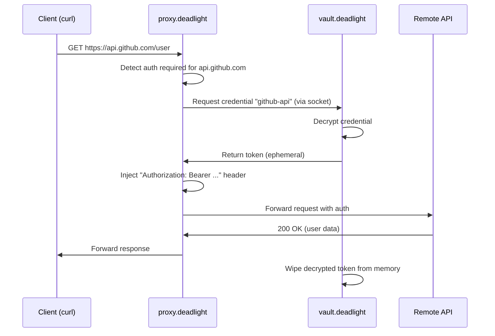

# Deadlight Credential Vault | Auto-Authentication Without the Internet


> A local-first vault that auto-authenticates CLI tools and proxied requests when networks are hostile or nonexistent.

[Why This Exists](#why-this-exists) · [Quick Start](#quick-start) · [How It Works](#how-it-works) · [Integration](#proxy-integration) · [Roadmap](#roadmap)

## Why this exists

SSH into 15 servers a day. You curl 10 APIs. You authenticate to internal services over a VPN that drops every 20 minutes. **Typing passwords is the bottleneck.**

Password managers solve this for browsers. Nothing solves it for terminals and proxied connections in the field.

| Actual workflows | Why existing tools fail | How vault.deadlight works |
|---------------------|-------------------------|---------------------------|
| **SSH to 10 boxes during an incident** | Type password 10 times or set up keys (but you're on a borrowed laptop) | `vault unlock` once → All SSH auths auto-injected via ssh-agent |
| **curl GitHub API from satellite link** | Type token, connection drops mid-paste, retry | Token stored locally, injected into request headers. Works offline |
| **Authenticate through proxy.deadlight** | Browser extensions don't work with SOCKS/HTTP proxies | Vault talks to proxy via socket. Credentials injected server-side |
| **Field laptop dies, switch to backup** | Cloud password managers need internet to sync | Export encrypted DB → USB stick → Import. 30 seconds, zero network |

**vault.deadlight does one thing well: eliminates manual credential entry for CLI tools and proxies.**

It's not trying to replace your browser's password manager. It's the missing piece for everything *outside* the browser.

## Part of the Deadlight Ecosystem

vault.deadlight extends **proxy.deadlight** with credential injection. Works standalone for CLI workflows, but shines when paired with the proxy.

```
┌──────────────────────────────────────┐
│      Deadlight Stack (Optional)      │
└──────────────────────────────────────┘

    ┌──────────────┐         ┌──────────────┐
    │    vault     │────────►│    proxy     │
    │  .deadlight  │  inject │  .deadlight  │
    │              │  creds  │              │
    │ CLI auto-    │         │ SOCKS/HTTP/  │
    │ auth + store │         │ MITM gateway │
    └──────────────┘         └──────────────┘
           │
           │  (reuses crypto)
           ▼
    ┌──────────────┐
    │     lib      │
    │  .deadlight  │
    │   C crypto   │
    └──────────────┘
```

**Standalone mode:** Auto-auth for SSH, curl, git, any CLI tool  
**With proxy:** Credential injection into proxied requests (transparent to the tool)

## Quick Start

### Build from source (2 minutes)

```bash
# Clone repository
git clone https://github.com/gnarzilla/vault.deadlight
cd vault.deadlight

# Build (zero external dependencies)
make
# → Outputs: deadlight_vault (~180KB)

# Initialize vault
./deadlight_vault init
# Prompts for master password
# Creates ~/.deadlight/vault.db (encrypted SQLite)

# Add your first credential
./deadlight_vault add github-api \
    --type token \
    --value ghp_xxxxxxxxxxxx

# Use it
./deadlight_vault exec github-api -- \
    curl -H "Authorization: Bearer {TOKEN}" \
    https://api.github.com/user
# → {TOKEN} replaced with decrypted value, no clipboard involved
```

Your credentials are now offline-available and never touch your keyboard again.

## How It Works

### The 30-second version

1. **Encrypt at rest:** Master password → ChaCha20-Poly1305 key → Encrypted SQLite blobs
2. **Decrypt on demand:** `vault exec github-api -- curl ...` → Decrypt token → Inject into command
3. **Wipe immediately:** Decrypted credential lives in memory for <100ms, then `secure_zero`
4. **Optional proxy mode:** Vault listens on Unix socket → proxy requests credentials → Injects into proxied traffic

### The cryptographic details

All crypto is ~300 LOC of public domain C (ChaCha20-Poly1305 + PBKDF2-SHA256):

```c
// Key derivation (master password → encryption key)
pbkdf2_sha256(
    master_password,
    salt,               // Random per-vault, stored in DB
    100000,             // Iterations
    derived_key         // 32 bytes for ChaCha20
);

// Encrypt credential
chacha20_poly1305_encrypt(
    plaintext_credential,
    derived_key,
    nonce,              // Random per-credential
    encrypted_blob      // Stored in SQLite
);

// Decrypt on use
chacha20_poly1305_decrypt(
    encrypted_blob,
    derived_key,
    nonce,
    plaintext           // ← This exists for ~100ms
);

secure_zero(plaintext, length);  // Wipe memory
```

**Why ChaCha20-Poly1305?**
- Software-only (no AES-NI required) → Works on old/embedded hardware
- Authenticated encryption (catches tampering) → Safer than AES-CBC
- ~300 LOC implementation → Auditable in an afternoon
- Public domain code → Zero licensing issues

**Why PBKDF2 over Argon2?**
- Already in lib.deadlight → No new code
- Sufficient for our threat model (offline attacks unlikely, 100k iterations)
- Smaller binary size

### Database Schema (SQLite)

```sql
CREATE TABLE vault_meta (
    version INTEGER,
    salt BLOB,              -- For master key derivation
    created_at INTEGER
);

CREATE TABLE credentials (
    id INTEGER PRIMARY KEY,
    name TEXT UNIQUE,       -- "github-api", "aws-prod", "ssh-bastion"
    type TEXT,              -- "token", "password", "ssh_key"
    encrypted_value BLOB,   -- ChaCha20-Poly1305 encrypted
    nonce BLOB,             -- Random per-credential
    metadata TEXT,          -- JSON: {"expires": "2026-12-31", "username": "..."}
    created_at INTEGER,
    last_used INTEGER
);
```

**Total size for 50 credentials:** ~40KB encrypted

## Core Features

### What it does
- **Encrypts credentials locally** – SQLite database, ChaCha20-Poly1305
- **Auto-injects into CLI commands** – `vault exec name -- command`
- **SSH agent integration** – Auto-loads SSH keys on unlock
- **Proxy socket API** – proxy.deadlight can request credentials
- **Offline export/import** – Encrypted DB dumps for airgapped transfers
- **Memory safety** – Secure wipes, constant-time comparisons

### What it doesn't do
- X Browser integration (use your browser's password manager)
- X Cloud sync (export/import manually, or use encrypted USB sticks)
- X 2FA/TOTP generation (out of scope, use `oathtool`)
- X Graphical interface (CLI only, keep it simple)
- X Multi-user vaults (one vault per system user)

### Command Reference

```bash
# Initialize new vault
vault init

# Add credentials
vault add github-api --type token --value ghp_xxx
vault add aws-prod --type password --username admin --password secret
vault add id_rsa --type ssh_key --file ~/.ssh/id_rsa

# List stored credentials
vault list

# Use credential in command (auto-inject)
vault exec github-api -- curl -H "Authorization: Bearer {TOKEN}" ...
vault exec aws-prod -- aws s3 ls  # Injects AWS_ACCESS_KEY_ID env vars

# Export vault (for backup or transfer)
vault export --output backup.vault.enc
# Transfer to another machine via USB/LoRa/whatever
vault import backup.vault.enc

# Lock/unlock (clears derived key from memory)
vault lock
vault unlock

# Delete credential
vault delete github-api

# Generate a new Identity for Federation
./deadlight_vault add my-blog-identity \
    --type identity \
    --algo ed25519 \
    --generate

# Output: 
# Public Key: dead...beef (Share this in your DNS TXT or Profile)
# Private Key: (Stored encrypted in DB)
```

## Proxy Integration

When running **proxy.deadlight**, vault can inject credentials into proxied requests:

### Setup

```bash
# Enable proxy mode (creates Unix socket)
vault config set proxy.enabled true
vault config set proxy.socket /var/run/deadlight_vault.sock

# Restart proxy with vault integration
# (proxy.deadlight will connect to socket on startup)
```

### How it works



**Transparent to the client.** You run:
```bash
curl --proxy socks5://localhost:1080 https://api.github.com/user
```

The proxy injects credentials automatically. No manual token pasting.

### Configuration

Tell vault which credentials to use for which domains:

```bash
vault add github-api \
    --type token \
    --value ghp_xxx \
    --proxy-match "api.github.com"

# Now all requests to api.github.com through the proxy auto-authenticate
```

## Use Cases

### DevOps on Terrible Networks

**Problem:** SSH to 20 AWS instances during incident response. Satellite link drops every 5 minutes.

**Solution:**
```bash
vault add aws-ssh --type ssh_key --file ~/.ssh/aws.pem
vault unlock  # Once per session

# All subsequent SSH commands auto-authenticate
for host in $(cat production_hosts.txt); do
    ssh -o ProxyCommand="vault-ssh-proxy" ubuntu@$host "systemctl restart app"
done
```

### API Workflows Without Clipboard

**Problem:** Testing API endpoints with curl. Copying tokens from 1Password every time.

**Solution:**
```bash
vault add stripe-test --type token --value sk_test_xxx
vault exec stripe-test -- curl https://api.stripe.com/v1/charges \
    -H "Authorization: Bearer {TOKEN}"
```

### Field Laptop Failover

**Problem:** Primary laptop dies. Backup laptop needs all your credentials. No internet.

**Solution:**
```bash
# On primary (before disaster)
vault export --output /mnt/usb/backup.vault.enc

# On backup laptop (after disaster)
vault import /mnt/usb/backup.vault.enc
vault unlock
# All credentials restored, zero network needed
```

### Proxy-Based Infrastructure Access

**Problem:** VPN requires MFA every 2 hours. Internal APIs need tokens. Browser doesn't help.

**Solution:**
```bash
# Run proxy with vault integration
proxy.deadlight --vault-socket /var/run/deadlight_vault.sock

# Configure tools to use proxy
export HTTP_PROXY=http://localhost:8080
export HTTPS_PROXY=http://localhost:8080

# All curl/wget/git/etc auto-authenticate through proxy
curl https://internal-api.corp/data
# → Vault injects token, proxy forwards, tool never sees credential
```

## Roadmap

### MVP (Current Focus)
-  ChaCha20-Poly1305 implementation (~300 LOC)
-  SQLite integration (encrypted blobs)
-  CLI commands: init, add, list, exec
-  Memory safety (secure_zero)
-  SSH agent integration
-  Proxy socket API

**Target:** Working end-to-end by February 2026

### Post-MVP (If Users Want It)
- Export/import encrypted backups
- `vault exec` environment variable injection (not just {TOKEN} replacement)
- Expiry handling (warn before credential expires)
- Audit log (optional, disabled by default)
- systemd integration (auto-unlock on login)

### Explicitly Out of Scope
- Browser extensions (use existing tools)
- Cloud sync (manual export/import is sufficient)
- GUI (CLI-first, always)
- 2FA generation (use `oathtool`)
- Windows support (WSL works, native not planned)

## Security

### Threat Model

**Protected against:**
-  Database theft (encrypted with strong key derivation)
-  Memory dumps (credentials wiped after <100ms)
-  Timing attacks (constant-time comparisons)
-  Tampering (Poly1305 MAC catches modifications)

**NOT protected against:**
- X Root-level malware (assumes trusted OS)
- X Unlocked vault on compromised system (user must lock vault when not in use)
- X Weak master passwords (enforcement planned, not yet implemented)
- X Physical attacks on running system (use full-disk encryption + lock timeouts)

### Why No Cloud Sync?

**By design.** Cloud sync introduces:
- Network dependency (defeats offline-first goal)
- Third-party trust (Dropbox/iCloud/etc sees encrypted blobs)
- Complex conflict resolution
- Larger attack surface

**Alternative:** Manual encrypted exports. Transfer via USB, LoRa, encrypted email—whatever your threat model allows.

### Audit Status

- **Crypto implementation:** Public domain ChaCha20-Poly1305 (reference: DJB's code)
- **SQLite:** Industry standard, used by browsers/phones/everything
- **Total custom code:** ~800 LOC (excluding SQLite amalgamation)

**Not yet audited by professionals.** Use at your own risk. Contributions welcome.

## Building from Source

### Prerequisites

```bash
# Debian/Ubuntu
apt-get install build-essential

# Alpine
apk add gcc musl-dev

# macOS
xcode-select --install
```

**That's it.** No external libraries.

### Compile

```bash
git clone https://github.com/gnarzilla/vault.deadlight
cd vault.deadlight
make

# Output: ./deadlight_vault (~180KB)
```

### Cross-compile for ARM

```bash
# Raspberry Pi
make CC=aarch64-linux-gnu-gcc

# Android (Termux)
# Already native, just run `make`
```

### Run Tests

```bash
make test

# Crypto primitive tests
make test-crypto

# Valgrind memory leak check
make test-memory
```

## FAQ

**Q: Why not just use `pass` or `gopass`?**  
A: Those are great for managing passwords. vault.deadlight is focused on *auto-injection* into CLI tools and proxy.deadlight integration. Different goals.

**Q: Is this trying to replace 1Password/Bitwarden?**  
A: No. Use those for browsers. This is for terminals and proxied connections.

**Q: Can I import from other password managers?**  
A: Not yet. Planned for post-MVP. For now, manual `vault add` commands.

**Q: What if I forget my master password?**  
A: You lose all credentials. No recovery mechanism by design. Write it down.

**Q: Does this work on Windows?**  
A: WSL works. Native Windows support not planned (accept PRs though).

**Q: Why SQLite instead of flat files?**  
A: Atomic transactions (corruption resistance), easier querying for proxy, better tooling.

**Q: How do I back up my vault?**  
A: `vault export` creates encrypted dump. Store on USB stick, encrypted cloud storage, whatever.

## Contributing

Open to PRs for:
- Bug fixes
- Documentation improvements
- Test coverage
- Platform support (BSD, etc.)


## License

MIT (see [LICENSE](LICENSE))

ChaCha20-Poly1305 implementation is public domain (DJB's original code)

## Contact

- **GitHub:** [@gnarzilla](https://github.com/gnarzilla)
- **Email:** gnarzilla@deadlight.boo

---

